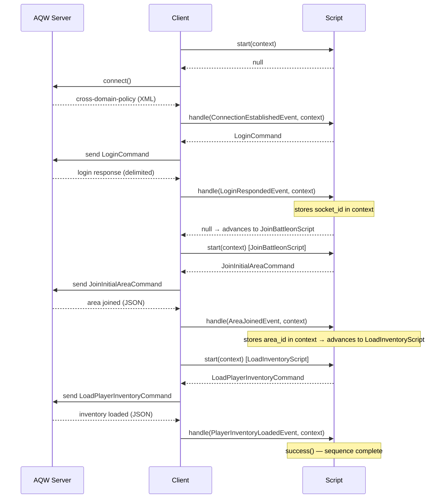

# AQW Socket Client

[](https://packagist.org/packages/dayvsonspacca/aqw-socket-client)
[](https://packagist.org/packages/dayvsonspacca/aqw-socket-client)
[](https://packagist.org/packages/dayvsonspacca/aqw-socket-client)

PHP client for connecting and interacting with **Adventure Quest Worlds (AQW)** servers.

Allows login, sending commands, and processing server events in a modular, script-driven way.

> **Note:** This client is not intended to serve as a bot. Its purpose is solely to explore the exchange of information with the AQW server and to retrieve data such as item names and player information.

> **Note:** This project would not have been possible without the following repositories — thank you!
> [anthony-hyo/swf2png](https://github.com/anthony-hyo/swf2png) · [dwiki08/loving](https://github.com/dwiki08/loving) · [Froztt13/aqw-python](https://github.com/Froztt13/aqw-python) · [BrenoHenrike/RBot](https://github.com/BrenoHenrike/RBot) · [133spider/AQLite](https://github.com/133spider/AQLite)

---

## How it works

The library is built around a simple, linear pipeline. Raw bytes come in from the socket, get parsed into typed messages, get interpreted as high-level events, and finally get handled by a **Script** — which decides what command to send back.


You write a **Script** that declares which events it cares about and reacts to them by returning a command. The client calls `start()` once before the loop begins, then receives messages, resolves events, and dispatches them until the script signals it's done.

Each script call returns **at most one command**, which is enqueued and sent on the next tick. A shared `ClientContext` flows through every call, letting scripts pass data between steps.



After `run()` completes, you can read the accumulated state via `context()`:

```php
$client->run(new LoginScript($playerName, $token));

$ctx      = $client->context();
$socketId = $ctx->get('socket_id'); // SocketIdentifier
$areaId   = $ctx->get('area_id');   // AreaIdentifier
```

---

## Pre-built Components

### 📜 Scripts

Scripts are the core unit of logic. The library ships with both **atomic scripts** (single-responsibility steps) and **composition primitives** for building sequences and pipelines.

#### Composition primitives

| Script | Description |
|---|---|
| `SequenceScript` | Runs a list of scripts in order. Advances to the next when the current one succeeds. Fails immediately if any child fails, disconnects, or expires. |
| `Pipeline` | Fluent DSL for simple linear flows: `Pipeline::send($cmd)->waitFor(SomeEvent::class)->orFailOn(OtherEvent::class)`. Interchangeable with class-based scripts inside `SequenceScript`. |

#### Login sequence

| Script | Description |
|---|---|
| `LoginScript` | Orchestrates the full login flow as a `SequenceScript` of three atomic steps (see below). |
| `ConnectAndLoginScript` | Sends `LoginCommand` on connection. On a successful `LoginRespondedEvent`, stores `socket_id` in context. |
| `JoinBattleonScript` | Sends `JoinInitialAreaCommand` on start. Succeeds when `AreaJoinedEvent` for `battleon` is received, storing `area_id` in context. |
| `LoadInventoryScript` | Sends `LoadPlayerInventoryCommand` on start (reading `socket_id` and `area_id` from context). Succeeds when `PlayerInventoryLoadedEvent` arrives. |

#### Base classes

| Class | When to use |
|---|---|
| `AbstractScript` | Base for all atomic scripts. Provides `success()`, `failed()`, `disconnected()`, `isDone()`, and a default no-op `start()`. |
| `ExpirableScript` | Extends `AbstractScript` with a configurable timeout. |

---

### ⚡ Events

Events are strongly-typed objects produced from raw server messages. They represent things that happened on the server side.

| Event | Trigger |
|---|---|
| `ConnectionEstablishedEvent` | Server sent the cross-domain policy — connection is ready. |
| `LoginRespondedEvent` | Server replied to a login attempt. |
| `AreaJoinedEvent` | Player successfully joined a map. |
| `PlayerDetectedEvent` | A player entered or changed state in the current area. |
| `PlayerInventoryLoadedEvent` | Server finished sending the player's inventory. |
| `PlayerLoggedOutEvent` | Server confirmed the player's session was terminated. |
| `AlreadyInAreaEvent` | Player is already in the target area. |
| `AreaLockedEvent` | Target area is locked and cannot be joined. |
| `AreaMemberOnlyEvent` | Target area is restricted to members only. |
| `AwayFromKeyboardEvent` | Player status changed to AFK. |
| `AreaNotAvailableEvent` | Target area is currently unavailable. |

---

### 📦 Commands

Commands are actions sent from the client to the server. Each one knows how to serialize itself into the correct protocol format via `pack()`.

| Command | Description |
|---|---|
| `LoginCommand` | Authenticates a player using their username and token. First command sent after connection. |
| `LogoutCommand` | Gracefully terminates the player's session on the server. |
| `JoinInitialAreaCommand` | Moves the player to the initial area (`battleon`) right after login. |
| `JoinAreaCommand` | Transfers the player to a specific map and room instance. |
| `LoadPlayerInventoryCommand` | Requests the player's full inventory from the server. |

---

## Extending

All core pieces are interface-driven, making the library easy to extend.

### Writing a custom script

Extend `AbstractScript`. Declare which events you handle in `handles()`, react in `handle()`, and optionally send an initial command from `start()`. Call `success()` or `failed()` when done.

```php
final class MyScript extends AbstractScript
{
    #[Override]
    public function start(ClientContext $context): ?CommandInterface
    {
        return new SomeCommand(); // sent immediately before the loop
    }

    #[Override]
    public function handles(): array
    {
        return [SomeEvent::class, ErrorEvent::class];
    }

    #[Override]
    public function handle(EventInterface $event, ClientContext $context): ?CommandInterface
    {
        if ($event instanceof ErrorEvent) {
            $this->failed();
            return null;
        }

        $context->set('result', $event->data);
        $this->success();
        return null;
    }
}
```

### Using Pipeline for simple flows

For common "send a command, wait for a response" patterns:

```php
$step = Pipeline::send(new SomeCommand())
    ->waitFor(SuccessEvent::class)
    ->orFailOn(ErrorEvent::class);
```

`Pipeline` is fully compatible with `SequenceScript`:

```php
$script = new SequenceScript([
    new ConnectAndLoginScript($name, $token),
    Pipeline::send(new JoinAreaCommand($area))->waitFor(AreaJoinedEvent::class),
]);
```

### Adding a new event

Implement `EventInterface::from(MessageInterface): ?EventInterface`. Return `null` if the message doesn't match.

### Adding a new command

Implement `CommandInterface::pack(): Packet`. Use `Packet::packetify()` with the `%xt%zm%cmd%...%` format.

### Custom socket

Implement `SocketInterface` — useful for testing or alternative transports.
