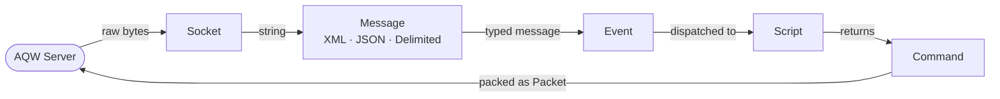
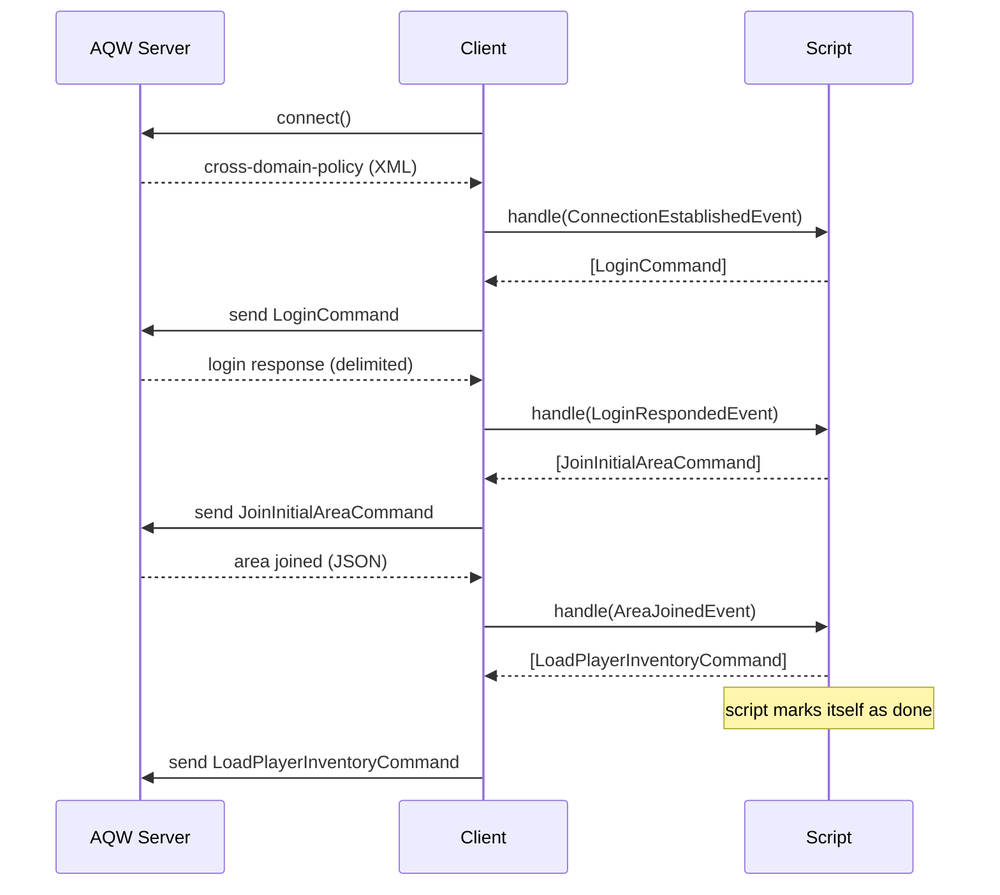

# AqwSocketClient

PHP client for connecting and interacting with **Adventure Quest Worlds (AQW)** servers.

Allows login, sending commands, and processing server events in a modular, script-driven way.

> **Note:** This client is not intended to serve as a bot. Its purpose is solely to explore the exchange of information with the AQW server and to retrieve data such as item names and player information.

> **Note:** This project would not have been possible without the following repositories — thank you!
> [anthony-hyo/swf2png](https://github.com/anthony-hyo/swf2png) · [dwiki08/loving](https://github.com/dwiki08/loving) · [Froztt13/aqw-python](https://github.com/Froztt13/aqw-python) · [BrenoHenrike/RBot](https://github.com/BrenoHenrike/RBot) · [133spider/AQLite](https://github.com/133spider/AQLite)

---

## How it works

The library is built around a simple, linear pipeline. Raw bytes come in from the socket, get parsed into typed messages, get interpreted as high-level events, and finally get handled by a **Script** — which decides what commands to send back.

You write a **Script** that declares which events it cares about and reacts to them by returning commands. The client drives the loop — receiving messages, resolving events, and dispatching them — until the script signals it's done.

---

## Pre-built Components

### 📜 Scripts

Scripts are the core unit of logic. Each script declares the events it listens to and reacts by returning commands. When finished, it calls `done()` to signal the client to stop.

| Script | Description |
|---|---|
| `LoginScript` | Handles the full login flow: authenticates, joins the initial area (`battleon`), and loads the player's inventory. Marks itself as done once the area is joined. |

---

### ⚡ Events

Events are strongly-typed objects produced from raw server messages. They represent things that happened on the server side.

| Event | Trigger |
|---|---|
| `ConnectionEstablishedEvent` | Server sent the cross-domain policy — connection is ready. |
| `LoginRespondedEvent` | Server replied to a login attempt. Carries `success` (bool) and a temporary `socketId`. |
| `AreaJoinedEvent` | Player successfully joined a map. Carries `mapName`, `mapNumber`, and `areaId`. |
| `PlayerDetectedEvent` | A player entered or changed in the current area. Carries the player's `name`. |
| `PlayerInventoryLoadedEvent` | Server finished sending the player's inventory data. |
| `PlayerLoggedOutEvent` | Server confirmed the player's session was terminated. |

---

### 📦 Commands

Commands are actions sent from the client to the server. Each one knows how to serialize itself into the correct protocol format via `pack()`.

| Command | Description |
|---|---|
| `LoginCommand` | Authenticates a player using their username and token. First command sent after connection. |
| `LogoutCommand` | Gracefully terminates the player's session on the server. |
| `JoinInitialAreaCommand` | Moves the player to the initial area (`battleon`) right after login. |
| `JoinMapCommand` | Transfers the player to a specific map and room instance. |
| `LoadPlayerInventoryCommand` | Requests the player's full inventory from the server. |
| `LoadShopCommand` | Requests the item data for a specific shop by ID. |

---

## Extending

All core pieces are interface-driven, making the library easy to extend:

- **New event?** Implement `EventInterface` — parse any `MessageInterface` and return a typed object.
- **New command?** Implement `CommandInterface` — serialize your data into a `Packet` via `pack()`.
- **New script?** Extend `AbstractScript` — declare your `handles()`, react in `handle()`, call `done()` when finished.
- **Custom socket?** Implement `SocketInterface` — useful for testing or alternative transports.
